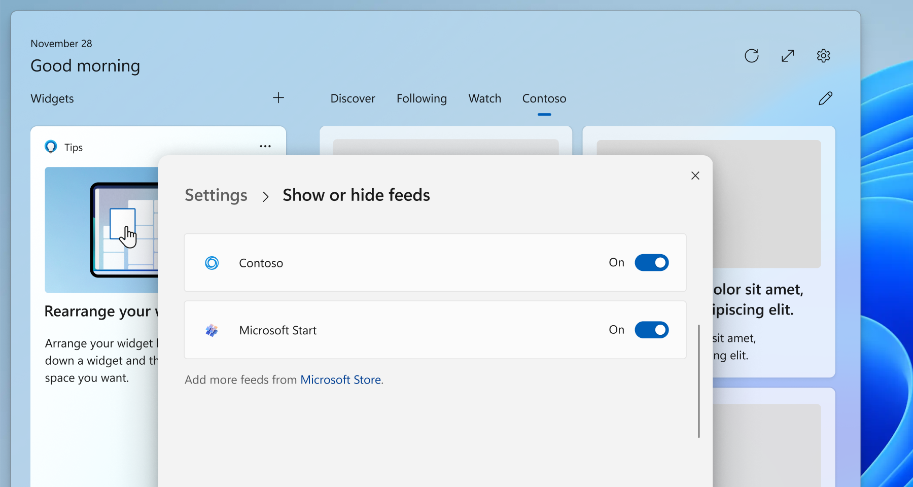

# Feed providers

> [!NOTE]
> **Some information relates to pre-released product, which may be substantially modified before it's commercially released. Microsoft makes no warranties, express or implied, with respect to the information provided here.**
> [!IMPORTANT]
> The feature described in this topic is available in Dev Channel preview builds of Windows starting with build TBD. For information on preview builds of Windows, see [Windows 10 Insider Preview](https://insider.windows.com/en-us/preview-windows).

The feed providers feature in the Windows App SDK is a new integration point for third-party applications distributed through the Microsoft Store. It enables these applications to register their content feeds to be directly available within the Windows Widgets Board, enhancing the user experience by providing quick access to a variety of content directly from the desktop.

This article introduces the concept of feed providers and provides a high-level explanation the feature. Detailed implementation guidance will be published in a future update.

Feeds in the Widgets Board helps users stay on top of what matters, enabling them to easily discover useful information and empowering them to act on it. Feed providers enable users to see content from multiple apps and services at the same time. Users can access content from various apps directly on their Widgets Board without the need to open individual apps, ensuring they have the latest information at their fingertips. Users also have the control to enable or disable feeds from the Widgets Board settings, tailoring the content to their preferences.

## Getting Started with Feed Providers

Apps that are ingested through the Microsoft Store can register as feed providers using the Windows App SDK. 

The following lists the high-level steps for developing a feed provider:

1.	**Register feeds** - Register your app's feeds in the app manifest. Once registered and detected, these feeds become directly available in the Widgets Board.
2.	**Implement feed experience** - Develop the feed experience as a web component that will be rendered within an i-frame on the Widgets Board. Feeds will appear as pivots above the **Feeds** section of the Widgets Board.
3.	**Provide personalization controls (optional)** - Each feed provider can define a personalization control dialog that allows users to customize their feed experience according to their preferences.

## Limitations and Considerations

- The Feed Providers feature is in preview. [add specific widgets package number here]
- This feature is only available to users in the European Economic Area (EEA). In the EEA, installed Microsoft Store apps that implement a feed provider can provide content feed in the Widgets Board.
- The feature requires using the latest Windows App SDK for app development. [add specific version number here]
- Specific technical and design guidelines must be adhered to for proper feed integration.

## Next Steps

Detailed implementation guidance will be provided in a future documentation update. 
