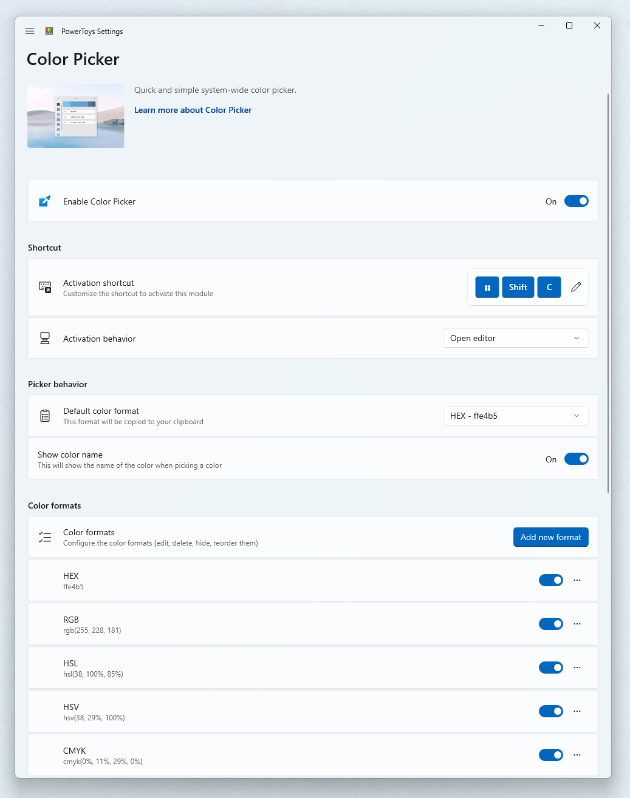

# Color Picker utility

A system-wide color picking utility for Windows to pick colors from any screen and copy it in a configurable format to the clipboard.

## Getting started

### Enabling Color Picker

Enable Color Picker in PowerToys Settings.

### Activating Color Picker

Choose what happens when you activate Color Picker (default: <kbd>Win</kbd>+<kbd>Shift</kbd>+<kbd>C</kbd>) by changing **Activation Behavior**:

:::image type="content" source="../images/pt-colorpicker-activation.gif" alt-text="Color Picker behaviors.":::

- **Open editor** opens an editor that lets you choose a color from the colors history, fine-tune a selected color, or pick a new color
- **Pick a color and open editor** activates Color Picker, then opens an editor and copies the selected color to the clipboard after you've picked a color
- **Only pick a color** activates Color Picker and copies the selected color to the clipboard

### Picking colors

After activating Color Picker, select a color on your screen to pick that color. If you want to see the area under your cursor in more detail, scroll up to zoom in.

Color Picker copies the selected color to the clipboard in the **Default color format** you've chosen in Color Picker's settings (default: HEX).

> [!TIP]
> To select the color of the non-hover state of a element:
>
> 1. Move the mouse pointer close, but not over the element.
> 2. Zoom in by scrolling the mouse wheel up. Image will be frozen.
> 3. In the enlarged area, you can pick the color of the element.

## Using the Color Picker editor

The Color Picker editor stores a history of up to 20 picked colors and lets you copy them to the clipboard. Choose which color formats are visible in the editor in **Color formats** in PowerToys Settings.

The colored bar at the top of the Color Picker editor lets you:

- fine tune your chosen color
- pick a similar color

To fine tune your chosen color, select the central color in the color bar. The fine-tuning control lets you change the color's **HSV**, **RGB**, and **HEX** values. **Select** adds the new color to the colors history.

To choose a similar color, select one of the segments on the top and bottom edges of the color bar. Selecting one of these similar colors adds it to the history.

To remove a color from the history, right-click a color and select **Remove**.

To export the colors history, right-click a color and select **Export**. You can group the values by colors or formats.

## Settings

Color Picker has the following settings:

| Setting | Description |
| :--- | :--- |
| **Activation shortcut** | The shortcut that activates Color Picker. |
| **Activation behavior** | Sets what happens when you activate Color Picker. Read more about this setting in [Activating Color Picker](#activating-color-picker). |
| **Default color format** | The color format that Color Picker copies to the clipboard. |
| **Show color name** | Shows a high-level representation of the color. For example, 'Light Green', 'Green', or 'Dark Green'. |
| **Color formats** | Enable and add different color formats, and change the order of color formats in the Color Picker editor. Read more about color formats in [Managing color formats](#managing-color-formats).

### Managing color formats

You can add, edit, delete, disable, and change the order of color formats in **Color formats**.

To change the order that color formats appear in the Color Picker editor, select the **more** button (•••) next to a color format and select **Move up** or **Move down**.

To disable a color format, turn off the toggle next to that color format. Color Picker doesn't show disabled color formats in the editor.

To delete a color format, select the **more** button (•••) next to a color format and select **Delete**.

To add a new color format, select **Add custom color format**. Enter the color format's **Name** and **Format**. The syntax for color formats is described in the dialog.

To edit a color format, select it from the list. Edit the color format's **Name** and **Format** in the **Edit custom color format** dialog. The syntax for color formats is described in the dialog.

Define color formats with these parameters:

| Parameter | Meaning             |
|-----------|---------------------|
| %Re  | red                 |
| %Gr  | green               |
| %Bl  | blue                |
| %Al  | alpha               |
| %Cy  | cyan                |
| %Ma  | magenta             |
| %Ye  | yellow              |
| %Bk  | Black key           |
| %Hu  | hue                 |
| %Si  | saturation (HSI)    |
| %Sl  | saturation (HSL)    |
| %Sb  | saturation (HSB)    |
| %Br  | brightness          |
| %In  | intensity           |
| %Hn  | hue (natural)       |
| %Ll  | lightness (natural) |
| %Lc  | lightness (CIE)     |
| %Va  | value               |
| %Wh  | whiteness           |
| %Bn  | blackness           |
| %Ca  | chromaticity A        |
| %Cb  | chromaticity B        |
| %Xv  | X value             |
| %Yv  | Y value             |
| %Zv  | Z value             |
| %Dv  | decimal value       |
| %Na  | color name          |

Format the red, green, blue and alpha values to the following formats:

| Formatter | Meaning                    |
|-----------|----------------------------|
| b    | byte value (default)       |
| h   | hex lowercase one digit    |
| H   | hex uppercase one digit    |
| x   | hex lowercase two digits   |
| X   | hex uppercase two digits   |
| f   | float with leading zero    |
| F   | float without leading zero |

For example `%ReX` means the red value in hex uppercase two digits format.

Color formats can contain any words or characters that you prefer. For example, the default color format, which shows up on color format creation is: `_'new Color (R = %Re, G = %Gr, B = %Bl)'_`.

## Limitations

- Color Picker can't display on top of the Start menu or Action Center, but you can still pick a color.
- If you started the currently focused application with an administrator elevation (**Run as administrator**), the Color Picker activation shortcut won't work, unless you also started PowerToys with administrator elevation.
- Wide Color Gamut (WCG) and High Dynamic Range (HDR) color formats are currently not supported.
